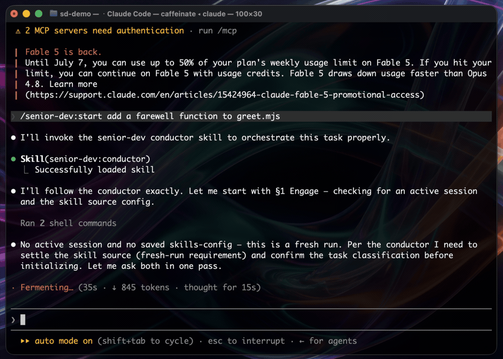
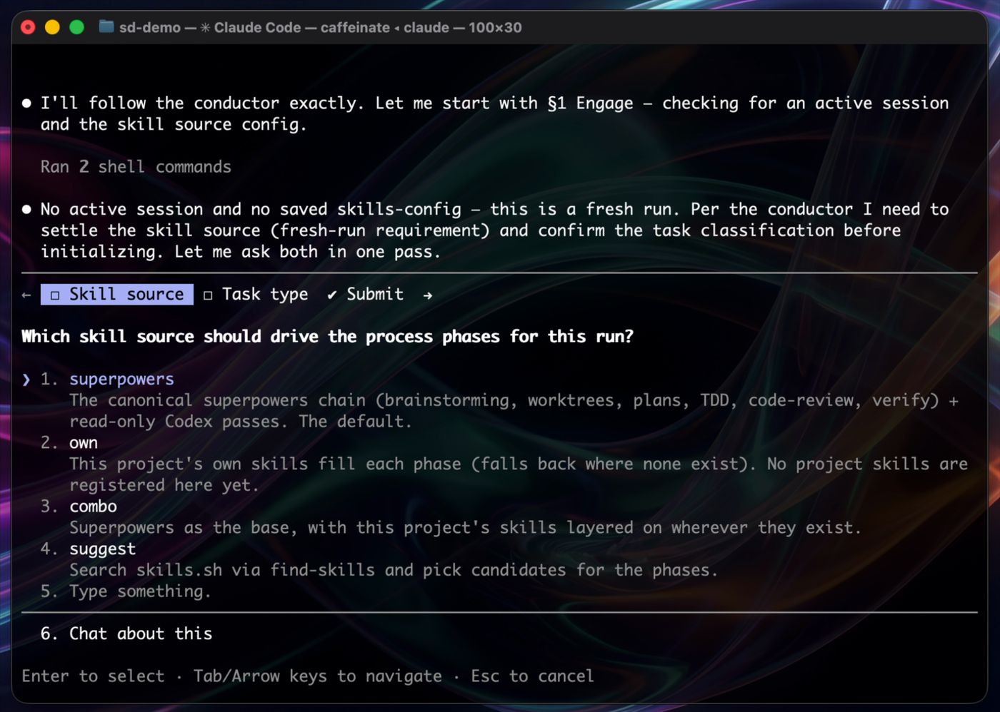
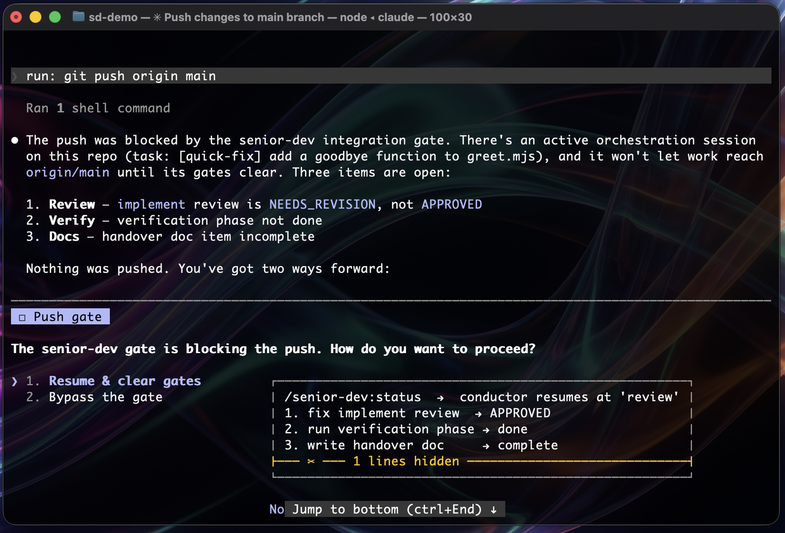
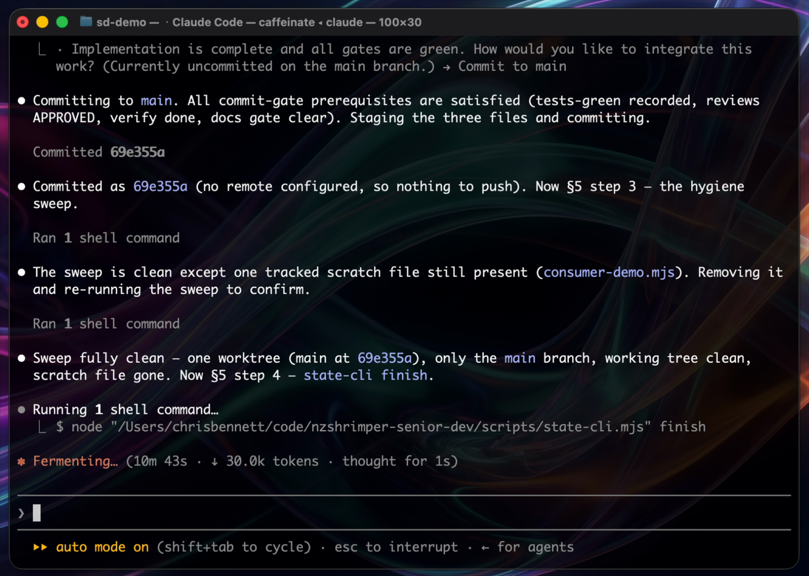

# senior-dev

> A disciplined senior developer, with a second reviewer over its shoulder, for every Claude Code coding session.

   

senior-dev turns an ordinary coding session into a run with rails: it classifies
the task, insists on the right chain of installed skills, reviews the work with
Claude **and** a read-only Codex pass, refuses to merge unreviewed or
undocumented changes, and finishes by proving the repo is clean. It orchestrates
skills you already have (superpowers, the codex plugin, the built-in
`/code-review` and `verify`); it duplicates none of them.

It fills a gap no other plugin does: routing across your whole installed skill
inventory, a cross-model review fired as a named phase gate, a documentation
gate that blocks completion the way a red test does, and a zero-leftovers
close-out check.

---

## What a run looks like

Every run opens the same way: the conductor settles which skills drive the
phases and how the task is classified, before a line of code is touched.



**1. Every run opens by asking which skills drive it.**



The four sources — your own skills, superpowers, a combination, or a
`find-skills` search — resolve which skill fills each fixed phase. Your choice
is saved per-repo in `.senior-dev/skills.json`, private by default.

**2. The gate blocks an unreviewed push, and says exactly why.**

Worktree commits need recorded green tests during implement/debug;
merge/push/PR needs approved reviews, verification, and a complete docs gate.
A blocked action names the exact missing items and hands you two ways forward —
resume and clear the gates, or bypass (logged):



**3. Finish proves the repo is clean, with evidence, not assertions.**

The hygiene sweep catches real leftovers — here it finds a stray scratch file,
removes it, and confirms a clean tree before archiving the session:



---

## What it adds

- **Conductor skill** (`senior-dev:conductor`) — classifies every coding task
  (feature / bug-fix / refactor / quick-fix / docs-only / investigation) and
  routes it through a mandatory chain of installed skills.
- **Skill-source choice** — every run opens by choosing who fills the process
  phases: your own skills, superpowers, a combination, or a `find-skills`
  search. Saved per-repo, private by default. (See below.)
- **SessionStart bootstrap** — in any git repo, announces the conductor and
  resumes in-flight sessions. Silent outside git repos.
- **Commit/integration gate** (PreToolUse) — worktree commits need recorded
  green tests during implement/debug; merge/push/PR needs approved reviews,
  verification, and a complete docs gate. Classification is command-aware
  (heredoc/quote stripping, env-prefix and global-flag handling), so quoted
  prose mentioning git is not false-blocked and flag-inserted forms are still
  caught.
- **Stop gate** — a session claiming "done" with open gate items gets the
  checklist back, once per distinct state (never loops).
- **Codex phase reviews** — read-only `/codex:review` verdicts per phase, a JSON
  verdict contract, a 3-cycle cap, and a post-review write-detection guard.
- **Docs gate** — spec, plan, handover, affected docs.
- **Hygiene sweep** — evidence-based zero-leftovers close.

All hooks fail open: a broken hook never blocks normal work. Gates arm only
while a session is active. `/senior-dev:bypass <reason>` is the logged escape
hatch, and a session genuinely parked on external work can stand the stop gate
down with `state-cli waiting --on "<what>"`.

## Where the gates hold

Claude Code is the richest host: the PreToolUse gate stops a gated action
before it even reaches git, the stop gate challenges premature "done", and the
SessionStart bootstrap auto-engages the conductor. Other hosts (Cowork, OpenAI
Codex) don't fire Claude Code plugin hooks (verified 2026-07) — but with the
universal guard installed, the commit/merge/push gates hold there too, enforced
by git itself. Without the guard, non-Claude-Code hosts run the conductor and
state tracking in advisory mode only.

## Choosing a skill source

Every run opens by asking which skills fill the process phases:

- **own** — your project's own skills
- **superpowers** (default) — the canonical chain
- **combo** — superpowers plus your project's skills where they exist
- **suggest** — search skills.sh via `find-skills` and pick

Your choice is saved per-repo in `.senior-dev/skills.json` (private by default;
run `state-cli skills-config share` to commit it for your team). A missing
process skill is never a dead end: the conductor gives you the exact install
command (and offers to run it) for a chain plugin, or `find-skills` candidates
for a domain skill — nothing installs without your yes.

## Universal enforcement (the guard)

The gates don't have to live only in Claude Code. On first run in a repo the
conductor offers to install the **universal guard**: real git hooks
(`pre-commit`, `pre-push`, `pre-merge-commit`) that run the same gate checks
from a self-contained bundle in `.senior-dev/guard/`. Existing hooks are
preserved and chained, never clobbered. With the guard installed, an
unreviewed push is blocked in Cowork, in OpenAI Codex, and in a plain
terminal — same message, same rules. `/senior-dev:guard` installs, checks, or
removes it; uninstall restores whatever hooks were there before.

One honest gap: `gh pr create` has no client-side git hook, so PR creation is
enforced only under Claude Code.

## Install

From the terminal — copy, paste, run:

```bash
claude plugin marketplace add nzshrimper/nzshrimper-senior-dev
claude plugin install senior-dev@nzshrimper-senior-dev
# restart Claude Code to load hooks
```

Or without the terminal: in Claude Code, run `/plugin`, add the marketplace
`nzshrimper/nzshrimper-senior-dev`, then find **senior-dev** under Discover and
click Install. Restart Claude Code to load the hooks either way.

<sub>Maintainer update flow: edit source, bump both versions in
`.claude-plugin/`, then `claude plugin marketplace update nzshrimper-senior-dev`
and `claude plugin update senior-dev@nzshrimper-senior-dev`, restart.</sub>

## Commands

| Command | Does |
|---|---|
| `/senior-dev:start [task]` | Start or resume an orchestrated session |
| `/senior-dev:status` | Phase/gate/review/bypass report |
| `/senior-dev:bypass <reason>` | One-shot logged gate waiver |
| `/senior-dev:skills [lane]` | Show and customise which skills fill each phase |
| `/senior-dev:guard [install\|status\|uninstall]` | Manage the universal enforcement git hooks |
| `/senior-dev:finish` | Final Codex pass, sweep, archive, evidence summary |

## State

`.senior-dev/state.json` in the target repo (auto-excluded via
`.git/info/exclude`; never touches your `.gitignore`). Your per-repo skill
source lives in `.senior-dev/skills.json`, private by default. Closed sessions
are archived to `.senior-dev/history/`.

## Companion plugins

Designed to drive: [superpowers](https://github.com/obra/superpowers) (process
skills), the OpenAI codex plugin (read-only review lanes), and the built-in
`/code-review` + `verify` skills. Missing companions degrade gracefully and are
reported, never silently skipped — the conductor points you at the exact install
and offers to run it.

## Tests

```bash
node --test tests/*.test.mjs
```

---

## Built by Foundry Studio

Foundry Studio is a modern build studio in Christchurch, New Zealand. One
builder, direct contact from first call to production handover. Modern stack,
plain language, direct contact.

This plugin is free and open. It came out of real client work, and it is a real
piece of work to point at. If it saves you a botched merge, that is the point.

**What the studio does.** Brand identity, design systems, web and app
development, product strategy, and AI integration, plus the boring bits no one
else will do. Fixed scope and fixed price where the brief is clear. No surprise
invoices. Days and weeks rather than quarters.

**Give-back.** One free website rebuild for a South Island organisation or
person doing genuine good, where a better website could genuinely help the
cause.

The work is the thing. [foundrystudio.app](https://foundrystudio.app) · Made
with attention. Christchurch, NZ.

---

[MIT License](LICENSE) · [Privacy](PRIVACY.md) — senior-dev collects nothing
and runs entirely on your machine.
